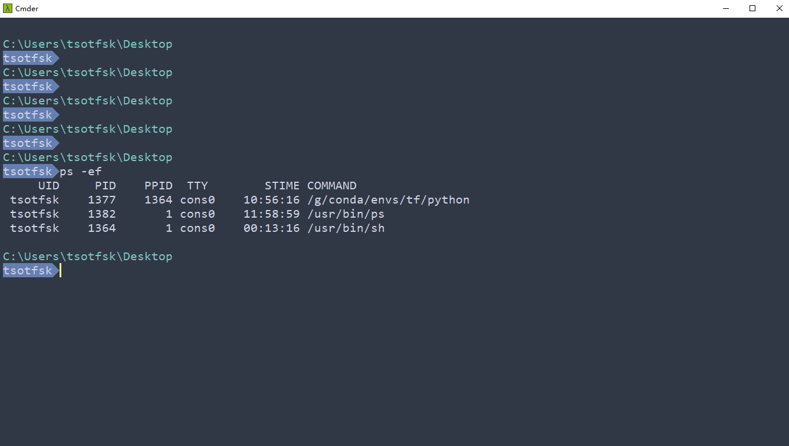
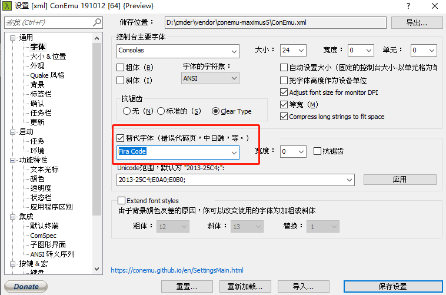
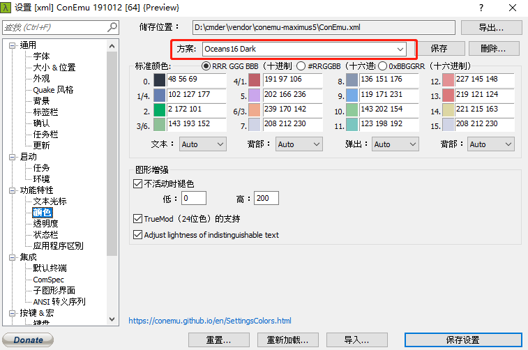

>开篇日常碎碎念: cmder是一个很好的终端模拟器，它基于ConEmu，可以美化系统自带的cmd命令行，然后还可以使用git，还自带有很多linux的shell命令，还可以作为vscode的运行终端。其实关于cmder的主题美化，官方的wiki也给出了一些可行插件，比如Terminus，但是它启动很慢，而且还有各种各样的恶性bug，所以属实难搞。同样，与cmder相关高亮插件对常使用python的玩家也不太友好，比如conda虚拟环境无法正常显示... 基于此，自己还是决定来简单配置一些比较easy的高亮和以及主题美化

<!--more-->

## Cmder lambda替换与高亮

- 首先找到cmder的安装位置, 这里我的在`D:\cmder`中，然后进入`D:\cmder\vendor`目录下找到`clink.lua`这个文件

- 定位到如下函数

```lua
  local function set_prompt_filter()
      -- get_cwd() is differently encoded than the clink.prompt.value, so everything other than
      -- pure ASCII will get garbled. So try to parse the current directory from the original prompt
      -- and only if that doesn't work, use get_cwd() directly.
      -- The matching relies on the default prompt which ends in X:\PATH\PATH>
      -- (no network path possible here!)
      local old_prompt = clink.prompt.value
      local cwd = old_prompt:match('.*(.:[^>]*)>')
      if cwd == nil then cwd = clink.get_cwd() end
  
      -- environment systems like pythons virtualenv change the PROMPT and usually
      -- set some variable. But the variables are differently named and we would never
      -- get them all, so try to parse the env name out of the PROMPT.
      -- envs are usually put in round or square parentheses and before the old prompt
      local env = old_prompt:match('.*%(([^%)]+)%).+:')
      -- also check for square brackets
      if env == nil then env = old_prompt:match('.*%[([^%]]+)%].+:') end
  
      -- build our own prompt
      -- orig: $E[1;32;40m$P$S{git}{hg}$S$_$E[1;30;40m{lamb}$S$E[0m
      -- color codes: "\x1b[1;37;40m"
      local cmder_prompt = "\x1b[1;36;40m{cwd} {git}{hg}{svn} \n\x1b[1;37;44m{lamb}\x1b[0;34;40m\x1b[0m"
      local lambda = "tsotfsk"
      cmder_prompt = string.gsub(cmder_prompt, "{cwd}", verbatim(cwd))
  
      if env ~= nil then
          lambda = "["..env.."]"..lambda
      end
      clink.prompt.value = string.gsub(cmder_prompt, "{lamb}", verbatim(lambda))
      -- clink.prompt.value = string.gsub(cmder_prompt, "{lamb}", "tsotfsk")
  end
```

- 虽然没学过lua，但是这段代码不难理解。

- 替换$\lambda$的话就把`lambda`赋值为自己想要的就可以了。比如我这里我直接用了我自己的ID

- 如果要做高亮之类的话，主要修改的是`cmder_prompt`这个变量。这里我先给出我目前的效果，如果嫌麻烦或者觉得我的还不错的话，可以直接复制我这段代码覆盖原函数，然后改一下`lambda`这个变量即可。

  

- 如果还想了解一下如何个性化定制，就需要研究那段字符串到底表达了什么。熟悉linux的小伙伴应该知道了，开头的`\x1b`是一个转义字符(16进制的ESC)，后面紧跟的`[`表示序列开头。那么这里我就简单列一些做高亮之类的，会用到的终端控制字符(来自百度)

  >1.一些特效
  >
  >\x1b[1m         设置高亮度
  >
  >\x1b[4m         下划线
  >
  >\x1b[5m         闪烁
  >
  >\x1b[7m         反显
  >
  >\x1b[8m         消隐
  >
  >\x1b[30m -- \x1b[37m   设置前景色
  >
  >\x1b[40m -- \x1b[47m   设置背景色
  >
  >
  >
  >2.文字背景色彩数字: (颜色范围:40 - 47)
  >
  >40:   黑色
  >
  >41:   深红色
  >
  >42:   绿色
  >
  >43:   黄色
  >
  >44:   蓝色
  >
  >45:   紫色
  >
  >46:   深绿色
  >
  >47:   白色
  >
  >
  >
  >3.文字前景色数字: (颜色范围: 30 - 39)
  >
  >30:   黑色
  >
  >31:   红色
  >
  >32:   绿色
  >
  >33:   黄色
  >
  >34:   蓝色
  >
  >35:   紫色
  >
  >36:   深绿色
  >
  >37:   白色

  那么`cmder_prompt`变量后的这段字符串就很好理解了，我们只需要比葫芦画瓢就可以自定义一些简单的高亮，比如我这里的的字符串为

  `"\x1b[1;36;40m{cwd} {git}{hg}{svn} \n\x1b[1;37;44m{lamb}\x1b[0;34;40m\x1b[0m"`

  从左向右开始：

  - `\x1b[1;36;40m{cwd}`：`1`设置了颜色为高亮度，`36`是前景色为深绿色，`40`表示后景色为黑色, `{cwd}`是工作路径变量，它是待定的，这个我们不关心。会在后面对其进行赋值，我们也不需要改动它

  - `{git}{hg}{svn} \n`: 这里定义了你可能使用到的工具，它会被放在工作路径后面，我们也无需修改, `\n`表示在此处换行

  - `\x1b[1;37;44m{lamb}`: 这里颜色部分不再赘述，最后的`{lamb}`就是你的lambda变量

  - `\x1b[0;34;40m`: 这里最后会有一个乱码``，在我这里呈现的是一个三角形的符号，因为比较好看。但是不同字体展示出的这个结果可能是不一样的，如果要改成和我一样的，请在cmder的settings的font部分，选择可以呈现出这种形状的字体，注意，这些更改是会实时渲染的，所以可以开一个cmder的终端，然后在这里一边选(鼠标滚轮)，一边看终端的改变就可以了。我简单试了下，系统自带的很多字体都可以达到这种效果的，不用额外下载。比如`Marlett`

    

    
    
   - `\x1b[0m`也就是关闭所有属性。后面该是啥是啥了，相当于结束。

   依据这些，我们就可以简单的做一些定制化的操作了~

## 更换cmder主题

cmder自带的一些主题属实难看，经常使用一些ide的同学可能会使用一些比如OneDark之类的主题，这些主题在cmder实际上都是可以复刻的！！

由于cmder基于conemu，有大佬已经收集了一些conemu的16位色的主题复刻:[base16-conemu](https://github.com/martinlindhe/base16-conemu)，那我们当然可以拿来用！！

- 首先下载下来，找到自己喜欢的主题，复制对应的xml的内容

- 然后从cmder的setting找到 `conemu.xml`的文件位置，如上图，我的就是`D:\cmder\vendor\conemu-maximus5\ConEmu.xml`

- 打开这个xml，检索到如下头部内容，可以检索`<key name="Colors"`

```xml
<key name="Colors" modified="2015-03-19 13:53:09" build="150310">
    <value name="Count" type="dword" data="00000001"/>
```

- 将你的内容复制到这之后就可以了，但还有两步很关键的步骤要做~

- 首先要把这里的`data`改成你当前加入的主题数！！，第一次加的话，就默认在`data`上加个1就行了

```xml
<value name="Count" type="long" data="4"/>
```

   - 更改你复制xml部分的第一行的name

```xml
<key name="Palette1" modified="2020-08-09 10:06:06" build="191012">
```

把这里的`Palette1`也是顺序更改就可以了，主要看你当前加入了多少主题。比如改成`Palette2`

那么至此，我们就把主题添加到了cmder中，之后主要在cmder的setting的颜色部分，选择你的方案就可以了，注意下面的颜色的Auto属性不要更改。

