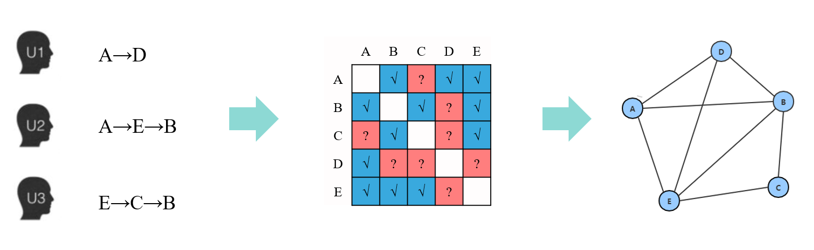
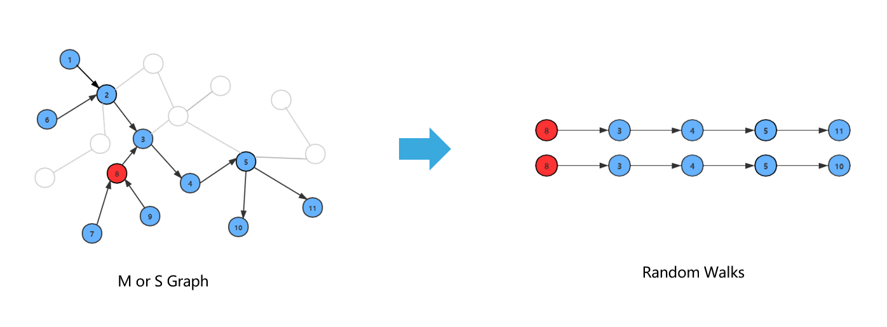
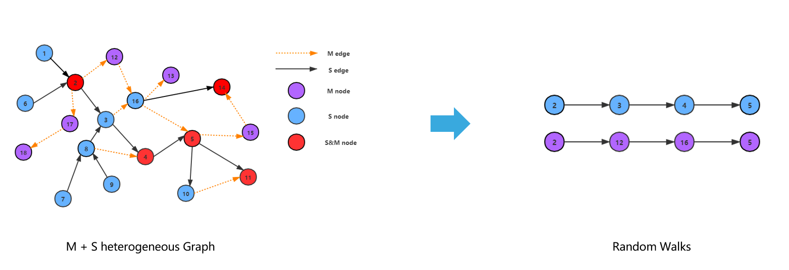
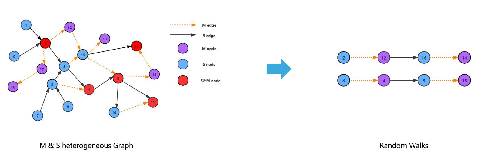

>距离KDD CUP 2020的比赛结束已经有半年了，正巧这学期选了一门复杂网络的课，大作业有一个选题是需要用GNN来做一些事，于是就考虑复盘一下这个比赛过程。由于我之前主要是在队伍中负责图神经网络的部分，当时做的不太理想，所以这次复盘也主要是对之前的工作进行反思以及改进。

<!--more-->

## 题目描述

此赛道关注于如何在推荐时平衡热门商品以及冷门商品，以对抗推荐系统中经常遇到的马太效应。

**使用数据**

数据采样自手机淘宝某促销阶段连续两周的点击数据。量级大概是3万用户，11万商品，然后有100万条点击记录。数据文件信息如下

**1)特征文件**

- 商品信息: <item_id>, <text_embedding>, <image_embedding>
- 用户信息: <user_id>, <user_age_level>, <user_gender>, <user_city_level>

**2)训练文件**

- 交互信息: `<user_id>, <item_id>, <time>`

**3)测试文件**

- 交互信息: `<user_id>, <item_id>, <time>`

- 预测信息: `<user_id>,  <q_time>`

**评测方式**

已知用户某$k-1$个时间点的交互数据，预测在第$k$个时间点用户会点击的商品。具体的，对每个用户召回$50$个商品，以最不热门的$50\%$商品的NDCG来衡量我们方法的好坏。

## 赛题解析

### 任务定义

首先这可以看作是一个序列推荐的任务，因为是给定一个q_time，预测用户会在这个q_time点击什么，但这并不是一个传统意义上的next item的而推荐，因为后续分析数据后发现，q_time对应的商品并不是用户曝光数据中的最后一个商品。同时我们发现用户特征信息缺失严重，所以仅使用了商品的多模态信息，以及用户的交互记录信息。

### 什么是推荐系统的bias？

题目中所描述的偏差，主要是两类:

**选择性偏差**：如果对用户历史进行建模，那收集的商品仅是所有商品的一个子集，模型之后则总会引导用户去购买出现过的商品。因为未曾被购买过的的商品对模型是未知的。(冷启动问题)

**流行度偏差**：商品的点击呈长尾分布，热门商品在正样本中频繁出现，其也就更容易被推荐，进而加剧马太效应。

### 如何缓解bias？

1) **充分利用文本和图片特征**。首先注意到题目中给出了商品的文本和图片表达，应当注意到这两个属性理论上是无偏的，即两者均无法显式的反应商品的流行程度。

2) **对于热门商品使用一定的权重惩罚**。即在推荐时，当按照分数高低排序时，引入一个权重因子来削弱热门商品的分数。

##  基于图的解决方案

大致流程如下:

**1)** 基于规则与共现得到第一个Item2Item的相似度矩阵。

**2)** 基于text embedding 和image embedding 得到 第二个Item2Item的相似度矩阵。

**3)** 依据两个相似度矩阵构图，取相似度top 50连边。图为有向有权图。

**4)** 在图上采用不同方法进行随机游走得到序列，然后利用Word2Vec得到商品表达。

**5)** 基于商品表达重构相似度矩阵，然后使用规则来为用户推荐商品。

后续会慢慢解释上述各种做法的原因。

###  为何构图？

为什么图表示学习的方法可能是有用的呢？这点我们受到了baseline以及赵老师的启发。在比赛初期，赛题讨论区放出了一个ItemCF的方法，我们试验后发现其效果非常的好，然后队友又基于规则进行了改进，这些改进使得我们甚至在比赛初期拿到了rank1的好结果，那ItemCF的方法的思想是什么呢？很简单，其核心就是构造一个商品之间的相似度矩阵。原始的ItemCF是基于共现来计算的这个矩阵，而我们改进后的ItemCF则综合考虑了商品曝光数量，用户点击数量，商品间点击间隔，点击时间先后等多种特征来计算。

那么很显然，根据我们的改进过程，可以发现，这个**相似度矩阵的质量，极大的影响了我们的推荐结果**。实际上，我们后续的所有实验几乎都是在**优化这个相似度矩阵**。注意到，相似度矩阵本身是可以转化为图的，其中相似度可以作为边权，商品则作为了节点。那么应用图表示学习的方法来重构这个相似度矩阵的观点便油然而生了。

### 如何构图？

- **多模态图(有向有权图)**： 取图片向量0.95+文本向量0.05，取每个商品top50相似的连边。构图后共有108916个节点，5445800条边
- **序列图(有向有权图)**：取每个用户序列内商品的全连接子图的方式进行构图，权重来自改进后的ItemCF的物品相似度矩阵，取每个商品的top50相似商品连边。构图后共有117720个节点，5876842条边。

为什么图片和文本要合在一起，然后取这样的比例？因为实际使用中发现文本向量质量不佳，图片向量的效果远好于文本向量，但稍微的引入一些文本向量，效果会提升那么一丢丢。

为何取top 50？实际上我们取过top 100 以及 top 500，发现大家的结果都差距不大，但是随着top k的k值的提升，学习代价是急剧增大的。碍于当时的硬件资源以及时间资源，我们最后取了50这个值。

为何图是有向的？实验中我们发现有向比无向要好，当然也可以用一个简单的例子来解释是：正向的话，买电脑之后更可能买一个鼠标。而逆向的话，买鼠标之后似乎不太可能买一台电脑。那么取Top 50后，鼠标是电脑的邻居，但是电脑可能就不是鼠标的邻居了。

###  图表示学习方法

- **M | S**：借鉴Node2Vec的概率转移方法在多模态图或者序列图上上游走生成路径，并学习表达。这是最自然的一种方法

- **M+S**：在M随机游走的路径与S随机游走的路径进行合并之后，再学习表达。之所以不采取图结构的直接合并再随机游走是因为二者相似度权重分布差异较大，无法直接进行概率比较而选择跳转。

- **M&S**：采用在两张图之间来回跳转的方式进行游走，比如S-M-S-M-S-M-S-M，概率转移方法同Node2Vec。注意到，这样就可以缓解权重分布差异大的问题，从而学习到一个S和M的联合分布。同时，由于两张图上的节点并不是子集关系，那么如果游走到某一节点后，没有与之对应的另外一模态的邻边，那么当前序列就会终止。

## 实验结果

我们使用RNDCG@50[2](#myfootnote2)来衡量我们推荐列表的效果

|                  | Hit@50 | NDCG@50 | RHit@50 | RNDCG@50 | Improve |
| ---------------- | ------ | ------- | ------- | -------- | ------- |
| ItemCF           | 0.1333 | 0.0538  | 0.0988  | 0.0391   | -       |
| ItemCF + M       | 0.1085 | 0.0397  | 0.1141  | 0.0419   | 7.1%    |
| ItemCF + S       | 0.1696 | 0.0684  | 0.1346  | 0.0535   | 36.8%   |
| ItemCF + M+S     | 0.1504 | 0.0615  | 0.1502  | 0.0595   | 52.3%   |
| ItemCF + M&S     | 0.1816 | 0.0705  | 0.1722  | 0.0646   | 65.2%   |
| Blend MS results | 0.2172 | 0.0903  | 0.1908  | 0.0773   | 97.9%   |

**NOTE**: Blend MS results指的是融合 M，S与M&S的方法。注意到这这种融合还能有不俗的提升，说明融合的游走方式可以学到一些单纯的M和S学不到的信息。

## 改进策略

- ItemCF主要有两个流程。一是构造相似度矩阵，二是利用相似度矩阵来进行推荐。而我们只改进了第一个阶段，实际上我们可以利用深度学习的方法，比如YotubeDNN来将图方法得到的商品表达用于召回。

- 多路召回。实际上，我们提到的算法大都是在ItemCF的框架下进行的，应当尝试一些不同的比如UserCF，Swing，甚至最基础的基于embedding的召回方式。这种多路一方面可以体现在相似度矩阵的构造上，一方面也可以直接作用在最后的召回分数上。
- 划分粗排和精排两个阶段。实际上，简单的规则往往用于粗排，我们可以选择一个适当的召回集大小，然后再构造一些特征，利用一些深度学习的方法或者树方法进行精排。
- 优化元路径种类。S-M-S-M可能并不是最优的组合方式。

## 总结

由于学期时间比较紧张，所以复盘中的各个结果，都是一套参数跑下来的，并没有进行过多的调参工作，那么实际的最优结果，肯定是都是要高于上表的。

1) **切勿迷信论文**。犹记得最初参加比赛时，自己还是一个懵懂的小白，那时候的自己迷信论文，总认为论文中的方法肯定是好的，不然怎么会发出来，然后就在github一顿搜索，然后代入数据取跑，发现结果都很一般。事实上，论文中的结果往往是在作者构造了一个精致的数据集的前提下产生的，他们可能本身就带有严重的bias，甚至在冷启动下根本无法运行！而且一种算法往往也很难fit到所有的数据集上，我在实验中甚至有的算法甚至几乎不推荐冷门商品！所以尽信书不如无书呀！实验是检验道理的唯一标准！

2)**知其然还要知其所以然**。有时候结果提升了，也还需要问自己一下为什么？这个在实验中多次被赵老师和王老师问到，但我一直没去思考，只是觉得"结果提升了，我哪知道为什么，这难道不是试着来的吗"。其实，很多时候，正是忽略了为什么，才导致下一步的提升很艰难。这里面自己走过了许多的弯路，比如LastItem的问题，每一阶段候选集的问题等等。有时候想破脑袋也没新的提升办法的时候，不如回过头来思考一下，前面的那么多的改进方案为什么work或者为什么不work，往往会柳暗花明又一村。

3) **天涯何处无芳草，何必单恋一枝花**。有时候一种方法不起作用，没必要死死纠缠，即使是自己代码写错了。我在当时的比赛中一直沉迷于PinSage以及GraphSage。但怎么测试都没能取到可行的结果，甚至结果非常的糟糕，一度怀疑人生，觉得自己菜的不行，耽误了很多时间。而且当时自己也一直相信GraphSage一定会比Node2Vec好。实际不然，现在回过头来思考Node2Vec以及GraphSage的原理，似乎在LinkPrediction这个问题上，真的难分伯仲。

## 参考文献

[1] [KDD Cup 2020 Challenges for Modern E-Commerce Platform: Debiasing](https://tianchi.aliyun.com/competition/entrance/231785/information)

[2] Aditya Grover and Jure Leskovec.node2vec: Scalable Feature Learning for Networks.

[3] [KDD Cup 2020 Debiasing比赛冠军技术方案及在美团的实践](https://tech.meituan.com/2020/08/20/kdd-cup-debiasing-practice.html)

[4] [A simple itemCF Baseline, score:0.1169(phase0-2)](https://tianchi.aliyun.com/forum/postDetail?spm=5176.12586969.1002.15.6c3f1f0bypIv8x&postId=103530)

<a name="myfootnote2">1</a>: RNDCG@50 只计算测试集中曝光量最少的那一半商品的的NDCG

