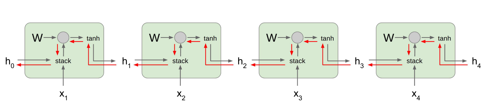

> 虽然标题写的是详解，但是依然不是新手入门向，尤其最近有DDL要赶，所以我只是结合自己的理解把我觉得有些难理解的稍微总结一下，未来有机会再来写详解。

<!--more-->

## LSTM(Long Short Term Memory)

LSTM的出现是解决RNN的长期依赖导致的梯度爆炸/消失的问题，那么梯度爆炸和梯度消失为什么会出现呢？

如上图，这是一个典型的RNN展开若干步的结构(图片取自[cs231n](http://cs231n.stanford.edu/syllabus.html) 第十节的课件)，在反向传播过程中，我们最关心的$dW$前的系数会出现多个$W$，如果这个序列很长，那么出现$W^N$，假设这个矩阵可以做特征值分解，那么显然
$$
W^N=U^{-1}\Sigma^{N}U
$$

- **当最大的特征值大于1的时候，就容易引起梯度爆炸**

  处理梯度爆炸的方式很简单，可以考虑梯度裁切。设置一个阈值$T$，比如当$||dW||\ge T$那么就让$dW={T\over||W||} \times dW$

- **当最大的特征值小于1的时候，就容易导致梯度消失**

  这个不太好解决，LSTM的出现正是为了缓解这种问题，注意到越靠前的部分$W$乘的次数越多，此时$dW$就很少，如果序列很长，那么很容易忽略开始的信息，也就是无法长期依赖的问题。

LSTM的计算过程如下

LSTM的这种传播方式可以解决一些长期依赖的问题，它相比RNN的特点是除了隐态$h(t)$还引入了$c(t)$，我们称之为细胞状态。而且内部结构更加复杂。有小伙伴可能要问了，$c(t)$相比于$h(t)$的区别在哪呢？为什么要引入这么个状态呢？我们从其结构图讲起

注意$h(t)$和$c(t)$的关系，$o$是经过$\sigma$激活函数后得到的，属于$(0,1)$范围内。而$c(t)$要过一个$tanh$激活函数是包含正负，可以更好的做梯度传播，那么显然$h(t)=o\bigodot tanh(c_t)$，就是从细胞状态$c(t)$中选择一部分出来用作展示，也可以说$c(t)$相比$h(t)$包含更多的信息，同时注意到$c(t)$并不包含复杂的运算，只有一个式子用来计算它，它主要用作综合当前细胞状态。除此之外，它还有一个很明显的特点，也正是LSTM用它的原因，见下图

红线表示梯度反向传播的路线，在这条路上，只有矩阵的数乘以及相加，所以其反向传播很快，那么它是如何缓解梯度消失的问题呢？

> 占坑，有空来填，因为要写反向传播的公式，我现在脑壳疼，所谓缓解，当然是体现在反向传播的数学公式上。但这个结构太复杂，所以反向传播的公式也很长，有空来补公式。

注意这里是缓解，但是并不能避免哦，实践还是会常常将$W$的参数初始化靠近$1$，这样可以缓解梯度消失。

这里给出一个LSTM一个单元内的传播情况，首先解释下图中的四个门的符号简写

- f: Forget gate:Whether to erase cell
- i: Input gate, whether to write to cell
- g: Gate gate (?), How much to write to cell
- o: Output gate, How much to reveal cell

> 实际上传播的过程有空再更新，先在这继续挖个坑，因为现在实在没时间写。

## GRU(Gated Recurrent Unit)

GRU的相比LSTM的话，结构简单，但是大多数应用中的效果是差不多的，简而言之就是**GRU以更低的计算成本取得了和LSTM差不多的效果**。

那么他简化了哪里呢？

- **两个状态合为一个状态。**注意到LSTM中式子中，$h(t)$不过是$c(t)$筛选的一部分，那么GRU索性把$h(t)$去掉了，这里的$h(t)$实际上相当于LSTM中的$c(t)$。
- **四个门变为两个门。**注意到这里$r$门相当于是$f$门，选择性的遗忘和保留一些之前的信息，然后就可以为接下来的计算提供信息。$z$门作为更新门，决定更新多少$h(t)$的信息，那么$(1-z)$不就表示保留多少更新了嘛。

显然这种结构更加简单，同样也保有梯度的高速公路，运算也相对简单。
