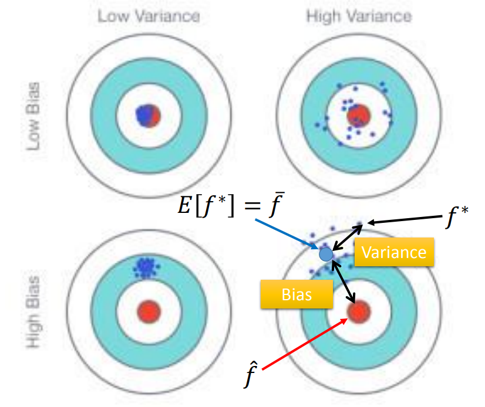
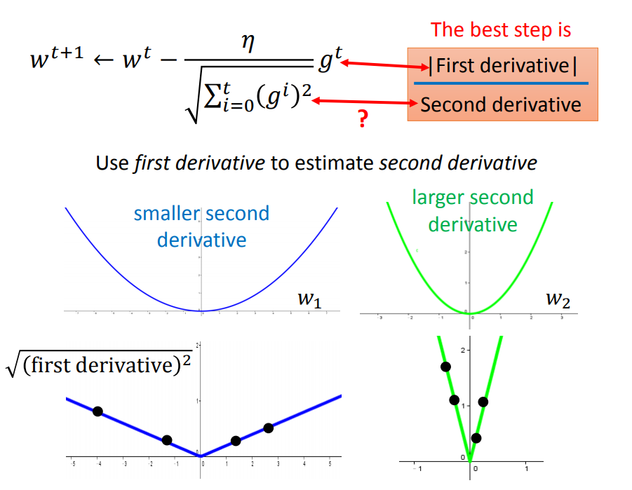
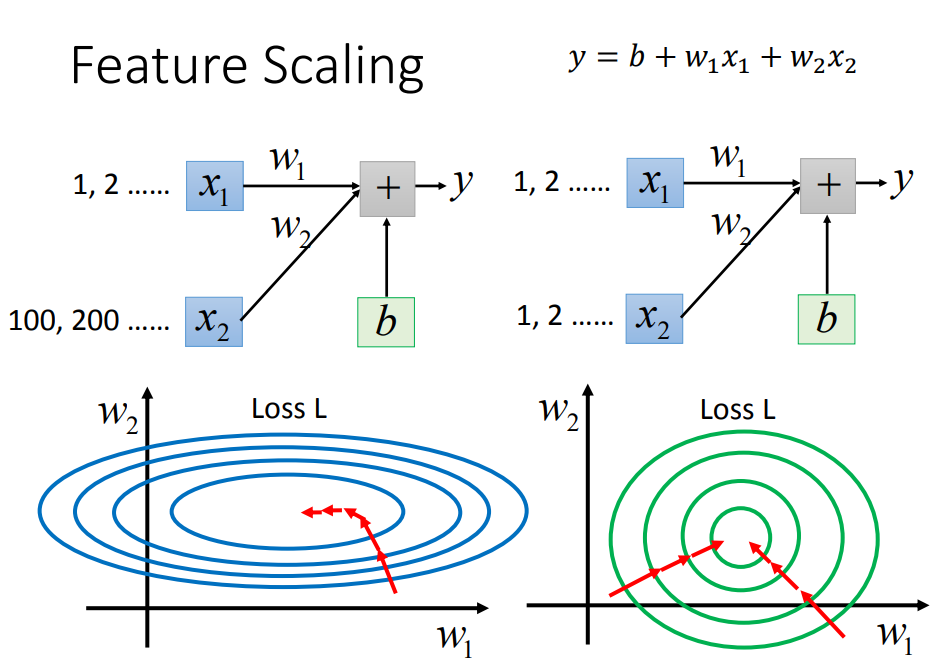
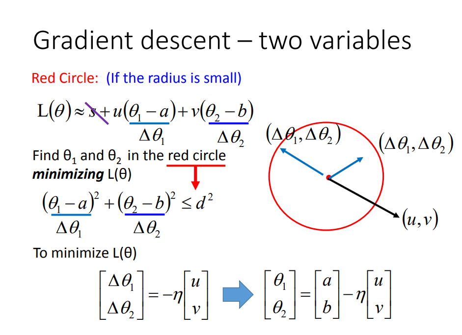

>之所以开这个目录并决定连载，是因为作为一个博客型选手，还没有完整的看过任何一个机器学习视频，书籍诸如西瓜书、花树什么的也没看过，所以底层建筑就非常的薄弱，很多东西都处在知其然而不知其所以然的地步。
>
>虽说机器学习发展日新月异，大家都在追赶潮流，但我觉得基础知识的沉淀还是十分有必要的，所以开个坑来补补基础知识。不过本系列仅作为本人查漏补缺用，所以仅会记录一些我不太懂的东西，或者一些我认为解释的非常妙的东西。

<!--more-->

### 1. 机器学习的bias和variance

靶心是target,bias是模型预测的均值与靶心的位置，方差是预测位置周围点的散步情况

- 过拟合是variance太大，比如高阶多项式，其往往容易过拟合。那么采取正则化是一种方案，**扩大数据集(增加采样点)**也是一种方案。
- 欠拟合是bias太大，比如常数多项式，variance是0，但是bias会很大，很多数据都不在点上。这种就是欠拟合。

### 2. adagrad的分子分母似乎是矛盾的?

梯度越大的变量下降的越快？直觉是这样，但是并不代表离最低点的距离是一样的，因为$\mu$是一致的。实际上$W$矩阵如果有两个参数$w_1,w_2$，其距离最低点都是一个二次曲线的loss，那么他们相同位置可能斜率不一致，斜率大的参数并不一定离原点就远，如何衡量远近需要除以二次导，adagrad分母的求和某种意义上可以理解为sample和，那么就可以模拟二次导，比如绿色sample的都很大，说明二次导比较大。

### 3.数据为什么要归一化？

圈圈都是俯视图，固定任何一个坐标做切面就可以理解了，左侧图受切入点影响，梯度不指向中心，会减速收敛，右侧任何位置梯度都指向圆心。

### 4.GD如何work的?

核心就是泰勒展开做一阶近似，在loss中选择一个点的邻域，固定半径r，如何找到loss最低点？找的最低点就是梯度反向。相当于点乘，$cos \theta=-1$，loss最小。