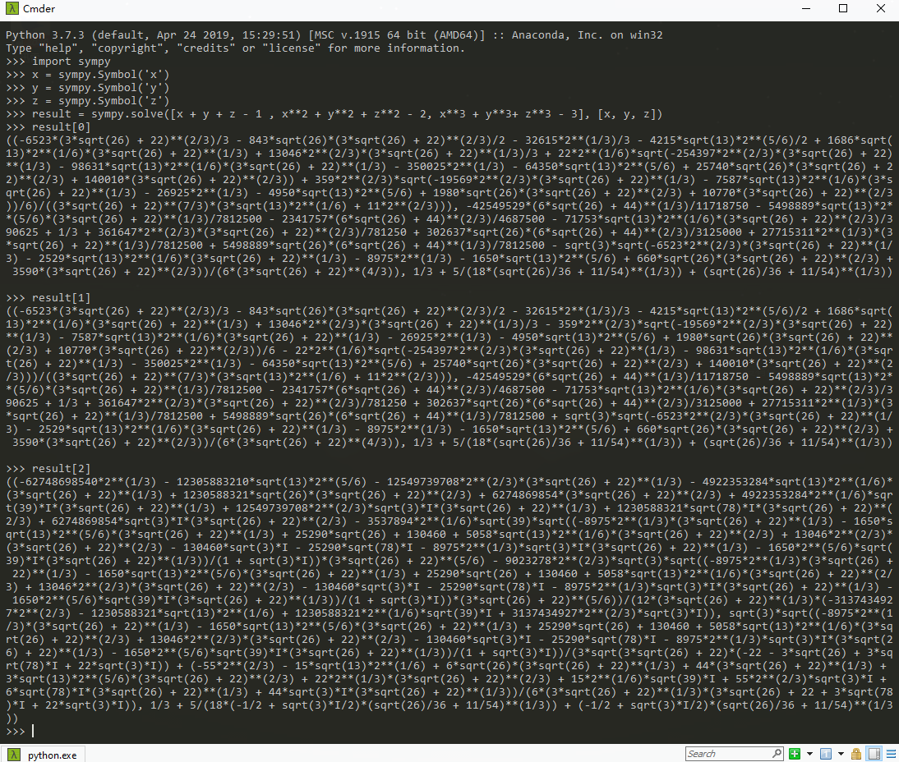

前段时间看到了一道十分有趣的数学题，如下
$$
\begin{align*}
&x+y+z=1 \\
&x^2+y^2+z^2=2 \\
&x^3+y^3+z^3=3 \\
&\cdots \\
&x^5+y^5+z^5=?
\end{align*}
$$
这规律看着挺明显哈，那$x^5+y^5+z^5$肯定等于$5$啊，这题小学僧都随便做~那很不好意思哦，这道题的答案其实是$6$(笑。

<!--more-->

我们先从一个最简单的做法做起，显然$x,y,z$是如下方程的解
$$
\begin{align*}
&(r-x)(r-y)(r-z)=0 \\
=>&r^3-(x+y+z)r^2+(xy+yz+xz)r-xyz=0  \tag{1}\\
\end{align*}
$$

- $x+y+z=1$
- $(x+y+z)^2=x^2+y^2+z^2 +2(xy+yz+xz) => xy+yz+xz={1-2 \over 2} = -{1 \over 2}$

- $x^3+y^3+z^3-3xyz=(x+y+z)(x^2+y^2+z^2-(xy+yz+xz))=>xyz={3-1 \times (2+{1\over2}) \over 3}={1\over6}$

将上述三个式子代入$(1)$式有
$$
r^3-r^2-{1\over2}r-{1\over6}=0 \tag{2}
$$
这里$r=x,y,z$的时候等式成立，那么对$(2)$式，我们左乘个$r$就有
$$
r^4-r^3-{1\over2}r^2-{1\over6}r=0
$$
然后分别将$x,y,z$代入可以得到
$$
\begin{cases}
x^4-x^3-{1\over2}x^2-{1\over6}x=0 \\
y^4-y^3-{1\over2}y^2-{1\over6}y=0 \\
z^4-z^3-{1\over2}z^2-{1\over6}z=0
\end{cases}
$$
三个式子相加，那么有
$$
(x^4+y^4+z^4)-(x^3+y^3+z^3)-{1\over2}(x^2+y^2+z^2)-{1\over6}(x+y+z)=0
$$
那么可以得到
$$
x^4+y^4+z^4=3+{1\over2}\times2+{1\over6}={25\over6}
$$
同理我们对$(2)$式左右同乘$r^2$，那么就有
$$
r^5-r^4-{1\over2}r^3-{1\over6}r^2=0 
$$
分别代入$x,y,z$相加，就有
$$
(x^5+y^5+z^5)-(x^4+y^4+z^4)-{1\over2}(x^3+y^3+z^3)-{1\over6}(x^2+y^2+z^2)=0
$$
那么就有
$$
(x^5+y^5+z^5)={25\over6} + {1\over 2} \times3+{1\over6}\times2=6
$$
这题到这里应该就结束了，但是我们要善于思考嘛，那$x^n+y^n+z^n$呢？注意到$(2)$式隐含的信息，假如我们令数列$a_n=x^n+y^n+z^n$，那么显然有$a_1=1,a_2=2,a_3=3$，此外根据刚才的运算，我们知道

$$
a_{n}-a_{n-1}-{1\over2}a_{n-2}-{1\over6}a_{n-3}=0
$$
那么依照矩阵求解递推式的原理，我们容易写出如下等式组
$$
\begin{cases}
a_{n}=a_{n-1}+{1\over2}a_{n-2}+{1\over6}a_{n-3} \\
a_{n-1}=a_{n-1} \\
a_{n-2}=a_{n-2}
\end{cases}
$$
将其写成矩阵的形式，那么有
$$
\begin{bmatrix}
a_n \\
a_{n-1} \\
a_{n-2} 
\end{bmatrix} = 
\begin{bmatrix}
1 &{1\over2} &{1\over6} \\
1 &0 &0 \\
0 &1 &0 
\end{bmatrix}
\begin{bmatrix}
a_{n-1} \\
a_{n-2} \\
a_{n-3} 
\end{bmatrix}
$$
那么将这个式子不断迭代，我们知道
$$
\begin{bmatrix}
a_n \\
a_{n-1} \\
a_{n-2} 
\end{bmatrix} = 
\begin{bmatrix}
1 &{1\over2} &{1\over6} \\
1 &0 &0 \\
0 &1 &0 
\end{bmatrix}^{n-3}
\begin{bmatrix}
3 \\
2 \\
1
\end{bmatrix}
$$
我们令
$$
A=\begin{bmatrix}
1 &{1\over2} &{1\over6} \\
1 &0 &0 \\
0 &1 &0 
\end{bmatrix}
$$
那么问题就转化成了求$A^n$的问题，那么我们知道矩阵的$n$次幂一般可以通过矩阵的特征值分解去求，但很可惜，这个矩阵并没有三个特征值，实际上在实数域上只有一个特征值，此外三次方程的求解比较麻烦，特征方程如下
$$
\lambda^3-\lambda^2-{1\over2}\lambda-{1\over6}=0 \tag{3}
$$
我这里就借助python的numpy库给出一个近似解

```python
import numpy as np
a = np.array([[1, 1/2, 1/6], [1, 0, 0], [0, 1, 0]])
eig = np.linalg.eigvals(a)
```
输出的结果，整理后如下
$$
\begin{align*}
&\lambda_1 = 1.43084957+0.j \\
&\lambda_2 = -0.21542478+0.2647132j\\
&\lambda_3 = -0.21542478-0.2647132j
\end{align*}
$$
正常的话，再依据这个矩阵求出特征向量之类，然后将$A$换成$U\Sigma U^T$，那么这题基本就算完事。可针对这道题呢？这三个特征值其实对应的就是$x,y,z$的解啊！！！因为方程$3$不就是方程$(2)$嘛？所以我们兜了个大圈子，最后发现还是直接解三次方程好一点。那么结果就有了
$$
x^n+y^n+z^n=1.43084957^n+(-0.21542478+0.2647132j)^n+(-0.21542478-0.2647132j)^n
$$
有人可能要质疑了，你这个解不行啊，不够math啊。说得好！！！我李某元也是这么认为的。那我就给你一组比较math的$x，y，z$的解，其实python的一个库sympy可以用来做符号计算，要求解我们的方程组，只需要下面几条代码就可以了

```python
import sympy
x = sympy.Symbol('x')
y = sympy.Symbol('y')
z = sympy.Symbol('z')
result = sympy.solve([x + y + z - 1 , x**2 + y**2 + z**2 - 2, x**3 + y**3+ z**3 - 3], [x, y, z])
```

输出的结果我给你整理一下哈，算了，懒得整理成latex的格式了，看个大概吧，嘻嘻~



图中的$result[0],result[1],result[2]$分别可以对应$x，y，z$的一组解，注意这个方程其实是有$6$组解的，我们这里只给出三个让大家瞅瞅啥样哈。不知道这个结果是不是你比较喜欢，反正我不喜欢...

好了，那么大功告成！！！！当然这道题也有更一般的解法，但是用到了群论、数论之类的，其实就是一些很基础的知识，只不过讲的高大上了点，和我的做法本质是一样的，这里不过多引入，有兴趣的可以看知乎上给出的[高大上的解法](https://zhuanlan.zhihu.com/p/96063757)。