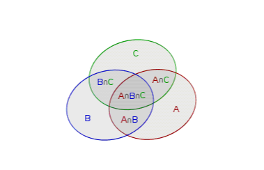

> 最近无所事事，决定再写一篇有趣的数学题，然后就开始认真干活。题目的意思很简单，也不是很难，之所以分享这道题是因为这道题不仅题目简短有趣，其涉及到的一些知识也十分有趣，甚至这个结论的应用也十分有趣。当然，本文依然延续我之前啰里啰嗦的习惯，大佬的话选择性的跳过看看就行。

题目如下：
$$
求证:与{n! \over e}最接近的整数是(n-1)的倍数,其中n \in N^+
$$
在解决这道题前，我们先对这道题简单的分析一下，首先要明确的就是"最接近"的含义，一个数$a$和某个整数$A$最接近的前提应该是
$$
|a-A| \leq { 1 \over 2}
$$
但是，要符合题目的条件，那么不可能存在两个整数和他最接近，也就是等号不会成立。因为两个相邻的整数显然不可能都是$n-1$的倍数，$n=1,2$除外，但容易验证这两种情况都不会使等号成立，也就是在本题中这个等号是取不到的。

那么如何下手呢？最自然的想法就是将$e^{-1}n!$写成两个数$A$与$B$的和，其中$A$是其最接近的整数，$B$是其小数部分，然后我们证明$A$是$n-1$的倍数，$B$的绝对值小于$1\over2$即可。那问题的解题方向也明了了，如何找到这两个$A$和$B$呢，注意这里有两个方向，也就是从$e^{-1}$入手或者$n!$入手，但显然从$e^{-1}$入手似乎比较直观，因为他并不是一个有理数。当然我们这里两种入手的解法我们都会给出。

<!--more-->

## **泰勒展开**

注意到$e^x$在$0$处的泰勒展开
$$
e^x=1+x+{x^2\over2!}+{x^3\over3!}+\cdots+{x^n\over n!}+\cdots
$$
当我们把$x$代入$-1$，左右同乘$n!$，那么就可以得到
$$
e^{-1}n!=n!(1-1+ {1\over2!}-{1\over3!}+\cdots+{(-1)^n\over n!}+{(-1)^{n+1}\over (n+1)!}+\cdots)
$$
注意到分母为$n!$的项是整数和小数的分界点，那么我们把这个式子以$n!$为分界，拆成两部分去看，那么就有
$$
\begin{align*}
e^{-1}n!&=n!(1-1+ {1\over2!}-{1\over3!}+\cdots+{(-1)^n\over n!})+n!\left({(-1)^{n+1}\over (n+1)!}+{(-1)^{n+2}\over (n+2)!}+\cdots\right) \\
&=A+B
\end{align*}
$$
先来讨论$A$，显然当$k<n-1$，$n! \over k!$是整数，而且还是$n-1$的倍数，当$k=n-1$以及当$k=n$时
$$
n!\left({(-1)^{n-1}\over (n-1)!}+{(-1)^n\over n!}\right)=(-1)^{n-1}(n-1)
$$
显然也是$n-1$的倍数，那么$A$就是($n-1)$的倍数，于是我们解决的重点就放在了$B$上，注意到$B$其实一个交错级数，那么我们不妨稍微改写一下
$$
\begin{align*}
B&=n!\left({(-1)^{n+1}\over (n+1)!}+{(-1)^{n+2}\over (n+2)!}+\cdots\right) \\
&=(-1)^{n+1}({1\over{n+1}}-{1\over{(n+1)(n+2)}}+{1\over{(n+1)(n+2)(n+3)}}-\cdots)
\end{align*}
$$
那么就有
$$
\begin{align*}
|B|&=|({1\over{n+1}}-{1\over{(n+1)(n+2)}})+({1\over{(n+1)(n+2)(n+3)}}- {1\over (n+1)(n+2)(n+3)(n+4)}) +\cdots | \\
&=({1\over{n+1}}-{1\over{(n+1)(n+2)}})+({1\over{(n+1)(n+2)(n+3)}}- {1\over (n+1)(n+2)(n+3)(n+4)}) +\cdots \\
&={1\over{n+1}}-({1\over{(n+1)(n+2)}}-{1\over{(n+1)(n+2)(n+3)}})-  \cdots \\
&<{1\over{n+1}}  \leq {1\over 2}
\end{align*}
$$
所以
$$
|e^{-1}n!-A|=|B|<{1\over2}
$$
也就是$A$是$e^{-1}n!$其最接近的整数，而$A$是$n-1$的倍数我们在之前已经证明，那么证毕。

对于这种解法，其实同样可以考虑使用带拉格朗日余项的泰勒展开，我们将其展开到第$n+1$项，然后也可以得到结论的显然性：
$$
e^{-1}n!=n!(1-1+ {1\over2!}-{1\over3!}+\cdots+{(-1)^n\over n!}+{(-1)^{n+1}e^{\theta}\over (n+1)!}),\theta\in(0,1)
$$
那么仿照前面的思路，容易发现这个拉格朗日余项乘以$n!$后，当$n\rightarrow \infty$的时候是趋近于$0$的，也就是等式左边无限趋近于$A$，证明题目中的最接近的话吗，只需简单的代入几个$n$去验证再加以阐述即可。

## **Gamma函数**

从$n!$入手的话要用到Gamma函数($\Gamma$函数)，这个函数相信大家应该不陌生，虽然可能了解的不是很多，但是大家应该至少都在大学数学教材中见过，它的形式如下:
$$
\Gamma(x)= \int_{0}^{\infty}t^{x-1}e^{-t}dt
$$
其中$x>0$，那么这个函数和本题又有什么关系呢？注意到这个这个函数通过分部积分可以得到如下的递推式
$$
\Gamma(x+1)=x\Gamma(x)
$$
显然如果$x$是整数的话，那么根据这个递推式我们就可以得到
$$
\Gamma(n+1)=n!\Gamma(1)
$$
注意到
$$
\Gamma(1)=\int_{0}^{\infty}e^{-t}dt=1
$$
那么就有$\Gamma(n+1)=n!$，这是一个非常有趣的性质，也许你又学会了$n!$的一种表示方法~，那么对于本题就有
$$
\begin{align*}
e^{-1}n!&=e^{-1}\Gamma(n+1) \\
&=\int_{0}^{\infty}t^ne^{-1-t}dt \\
&=\int_{1}^{\infty}(r-1)^ne^{-r}dr  \tag{令$r=-1-t$}\\
&= \int_{0}^{\infty} - \int_{0}^{1} (r-1)^ne^{-r}dr\\
&=\int_{0}^{\infty}\sum_{k=0}^{n}C_n^{k}r^k(-1)^{n-k}e^{-r}dr - \int_{0}^{1} (r-1)^ne^{-r}dr \tag{二项式定理} \\
&=\sum_{k=0}^{n}C_n^{k}(-1)^{n-k}\Gamma(k+1)-\int_{0}^{1} (r-1)^ne^{-r}dr \\
&=\sum_{k=0}^{n}C_n^{k}(-1)^{n-k}k!-\int_{0}^{1} (r-1)^ne^{-r}dr  ) \\
&=\sum_{k=0}^{n}{n!\over(n-k)! }(-1)^{n-k}-\int_{0}^{1} (r-1)^ne^{-r}dr   \\
&=A+B
\end{align*}
$$
显然这里的$A$与上一种解法中的$A$是一样的，那么对于$B$呢？注意到
$$
0 \leq |B|=\int_{0}^{1}(1-r)^ne^{-r}dt < \int_0^1 (1-r)^ndr={1\over n+1} \leq {1\over2}
$$
同时注意到
$$
{d\left(\int_{0}^{1}(1-r)^ne^{-r}\right) \over dn} =\int_{0}^{1}(1-r)^nln(1-r)e^{-r}<0 
$$
那么可知这个积分是单调递减的，那么$|B|<{1\over2}$就十分显然了。至此，本题的两种解法都已经给出，一个从分母的$e$入手，通过无穷级数来探讨，另一种则通过分子的$n!$入手，通过Gamma函数来解决问题，两种解法都非常的精妙。但问题止步于此总有些遗憾，我们注意到根据我们的推导，题目中的式子当$n \rightarrow \infty$时有
$$
\lim_{n \rightarrow \infty}e^{-1}n!=A=n!(1-1+ {1\over2!}-{1\over3!}+\cdots+{(-1)^n\over n!})
$$
如果对概率论比较了解的同学，应该知道这是个什么东西，是滴，它的名字叫**全错排数​**。

## **全错排数**

全错排数中最有名的例子，或许就是信封问题了，也许大家也不陌生，就是将$n$封信放入$n$个信封中，问全部装错的情况有多少种。我们这里使用容斥原理给出一种比较直观的解法。也许有的小伙伴对容斥定理还不太了解，那么就在此简单啰嗦两句。实际上从集合的角度去理解容斥原理比较容易，一个典型性的例子就是使用韦恩图(图网上找的)

    

那么有
$$
|A \cup B \cup C|=|A|+|B|+|C|-|A \cap B|-|B\cap C|-|A\cap C|+|A \cap B \cap C|
$$
这个从图中很好理解，就是不断地减加，去掉多余的和补充多减的部分即可。如果拓展到$N$的话就是
$$
\begin{align*}
&| A_1 \cup  A_2 \cup A_3 \cup \cdots  A_n| = \sum_{i}^{n}|A_i|-\sum_{i<j}^{n}|A_i \cap A_j|+\sum_{i<j<k}^{n}| A_i \cap A_j \cap A_k| -\cdots+(-1)^n| A_1 \cap  A_2 \cap  A_3 \cap \cdots  A_n|
\end{align*}
$$
那么对于我们的信封问题，我们记$A_i$为第$i$封信放在第$i$个信封之后的排列数，那么所谓的全错拍数就是
$$
\begin{align*}
D&= |\overline A_1 \cap \overline A_2 \cap \overline A_3 \cap \cdots \overline A_n| \\
&= S-| A_1 \cup  A_2 \cup A_3 \cup \cdots  A_n|  \\
&=A_n^{n}-C_n^{1}A_{n-1}^{n-1}+C_n^{2}A_{n-2}^{n-2}+\cdots+(-1)^{n-1}C_n^{n-1}A_{1}^{1}+(-1)^nC_n^{n} \\
&=n!(1-1+ {1\over2!}-{1\over3!}+\cdots+{(-1)^n\over n!})
\end{align*}
$$
这个公式的倒数第二行其实也很好理解，因为我们把$A_i$看做第$i$封信放在第$i$个信封之后的排列数，那么显然一个放好后其他位置的排列数就是$A_{n-1}^{n-1}$，两个放好后其他位置的排列数就是$A_{n-2}^{n-2}$，以此类推，而这些排列数前面的组合数也很好理解，就是我挑选要取交集的的$A_i$的个数，我挑选一个就是$C_n^1$，我挑选两个就是$C_n^2$，以此类推。

## **应用**

最后总结升华一下，既然这道题我们已经解决了，而且我们也通过这道题给大家介绍了一下全错排数，那么他们之间的关系又有什么应用呢？

注意到我们通过先前证明可以得到与$e^{-1}n!$最接近的整数就是全错排数，那么反之如果我们现在要去求解全错排数呢？我们可以通过去计算$e^{-1}n!$然后取最接近的整数，去代替求解全错排数！！！也就是说我们有
$$
\lfloor e^{-1}n!+{1\over2} \rfloor=n!(1-1+ {1\over2!}-{1\over3!}+\cdots+{(-1)^n\over n!})
$$
$\lfloor x\rfloor$表示对$x$取下整。其中补正的$1\over2$是为了让这个整数的活动区间固定在一个整数内。

不学计算机的同学可能不太理解这么做有什么意义，其实这可以大大降低计算的复杂度，因为可以看到的是，等式右侧充斥着阶乘和和加减法，它要计算接近$n$次的阶乘，然后再做$n$次加减法，还有一次乘法，但是呢，等式的左侧只需要计算一次阶乘！再外加一次乘法和一次加法！！！运算量就少了很多！！！