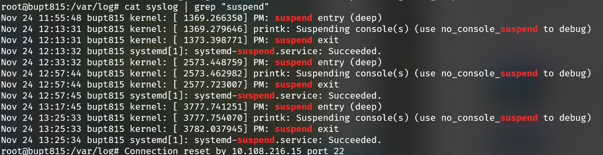

>心心念念的服务器终于到了，由于现阶段英伟达的30系显卡在深度学习方面的适配还不是很完善，而且自己也不太了解服务器配置方面的内容，所以这里记录一下常见的问题以及解决方案，供自己翻阅，也方便后人管理。

<!--more-->

**Note:**

- `<xxx>`表示内容，即需要将其替换为指定的内容，比如使用登录校园网命令，`login-net <学号> <密码>`，要在这条命令里做相应的替换，其他命令同理
- 由于我们的操作系统是`ubuntu20.04-server`，所以里面的一些问题的解决方案可能在其他版本中会失效。

### 1. 显卡安装完驱动后系统总是隔一段时间休眠？

**现象描述**: 之前让学弟在服务器装完显卡驱动后遇到了这个问题。ssh连到服务器上后，总是隔一段时间就断开链接。查看系统日志后发现，有个图形化进程会在每次断开附近被挂起，一直在**suspend**，于是怀疑是系统进入休眠，后经学弟证实，可能是安装时引入了图形化界面，那么只需要将对应的图形化界面卸载就可以了。

**解决方法:** 

```shell
sudo apt autoremove gnome-desktop3-data
```

### 2. nvidia-smi命令在重启后消失了？

**现象描述**: 服务器reboot后内核更新，导致nvidia-smi不匹配。重装显卡驱动就行了，然后记得关闭系统内核的自动升级

```text
NVIDIA-SMI has failed because it couldn't communicate with the NVIDIA driver. 
Make sure that the latest NVIDIA driver is installed and running.
```

**解决方法:** 

**1) 关闭系统内核的自动升级**

```shell
sudo apt-mark hold linux-image-generic linux-headers-generic 
```

**2) 重装显卡驱动**

```shell
# 查看之前安装的驱动版本号, 得到<version>
ls /usr/src | grep nvidia

# 上述命令输出<version>后，利用dkms构建nvidia驱动
sudo apt install dkms
sudo dkms install -m nvidia -v <version>
```

### 3.nvidia-smi显示两个一样的进程?

**现象描述:** 调用nvidia-smi后，会在两块GPU显示同一进程，其中一个占用显存，但另一个不占用显存。查阅相关资料后发现，这个问题也许是新的驱动或者30系双卡交火的适配问题，而且仅仅是显示问题，所以就用了一种比较丑陋的方法来解决，就是将这个命令alias一下，然后删除同名的显示。

**解决方法:** 可以在root用户下, 将如下命令添加到`/etc/bash.bashrc`文件内，以激活全局配置(所有用户都能用)

```bash
# alias
alias nvidia-smi='func() { nvidia-smi $* | grep -v "N/A.* 0MiB"; }; func'
```

### 4.如何设置校园网登录命令?

**现象描述:** 每次都要用那个curl来登录校园网，就很烦，命令也记不住，于是干脆就把这个写成个命令，就会方便很多了。

**解决方案:** 在root权限下，将如下命令添加到`/etc/bash.bashrc`文件内，以激活全局配置(所有用户都能用)，目前这种方法可能看着还是比较low，我觉得理想的状态是，当用户通过终端登录到服务器后，自动运行一个设置好的shell脚本，来实现自动联网。

```
alias login-net='func() { curl http://10.3.8.211/login --data "user=$1&pass=$2" > /dev/null; }; func'
alias logout-net='curl -L http://10.3.8.211/logout > /dev/null'
```

### 5.如何创建账号以及分配权限

**现象描述:** 作为一个服务器管理员，那么分配账号自然是家常便饭了。PS：脑壳疼，一台服务器10个人用，真是资源匮乏啊。

**解决方案:**

**1) 添加账号的三板斧**

```shell
# 添加用户
useradd -d /home/<username> <username>

# 更改用户使用的shell类型
usermod -s /bin/bash <username>

# 设置密码
pwd <username>
```

**2) 分配权限**

```shell
# sudo权限
usermod -a -G sudo <username>

# docker
usermod -a -G docker <username>
```

**3) 删除用户**

PS：加入`-r`参数同样会删除掉用户的工作目录

```
userdel -r <username>
```

### 6. 如何免密登录服务器？

**现象描述:** 每次通过终端访问或者vscode访问服务器都要输入密码，很烦！尤其是vscode开发过程中，要打开多个服务器工作目录，就要一次又一次输密码，真是脑壳疼！实际上，可以通过传输对应的rsa密钥，然后实现免密登录

**解决方案**：如果`C:\Users\<local_username>\.ssh`目录下，没有名字叫`id_rsa.pub`的文件，则需要先运行命令1)，有的话则跳过1)

**1) 生成rsa密钥**

```shell
ssh-keygen -t rsa -C "<your_email>@<youremail>.com"
```

**2) 添加rsa密钥到远程服务器**

```shell
# 首先进入windows下的目录
cd C:\Users\<local_username>\.ssh

# scp到服务器上
scp id_rsa.pub <username>@<ip>:/home/<username>/id_rsa.pub

# 登录进入服务器
ssh <username>@<ip>
mkdir .ssh
cat id_rsa.pub >> .ssh/authorized_keys
rm id_rsa.pub
```

### 7. 服务器如何扩容？

**现象描述:** 因为服务器是加载在固态里的，但是我们还有几个T的机械，所以就想把机械硬盘挂载到`/home`目录，算是扩容嘛，不然所有用户加起来就512G，顶不住啊。

**解决方案:** 

有空再来更新

**1) 合并多个机械硬盘**

**2) 实现硬盘的挂载**

###  8. 服务器如何上电自启动?

**现象描述:** 假期在家恰逢实验室断电，因为周边小区要检查电路。但是实验室里面又没人，那么实验室来电之后就必须要有人手动启动服务器才能运行。这显然是不行的，所以应该对服务器设置上电自启动。

**解决方案:** 

有空再来更新

bios设置